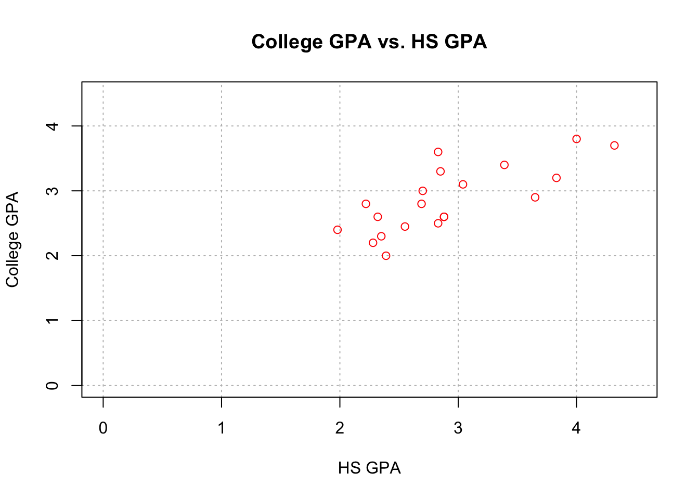
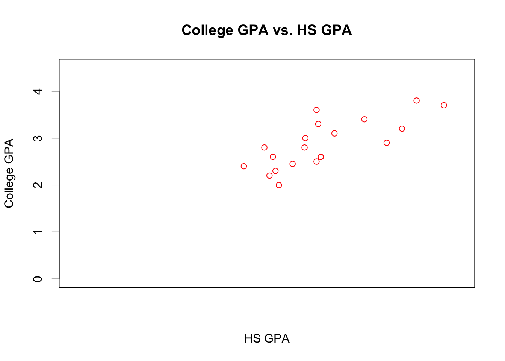
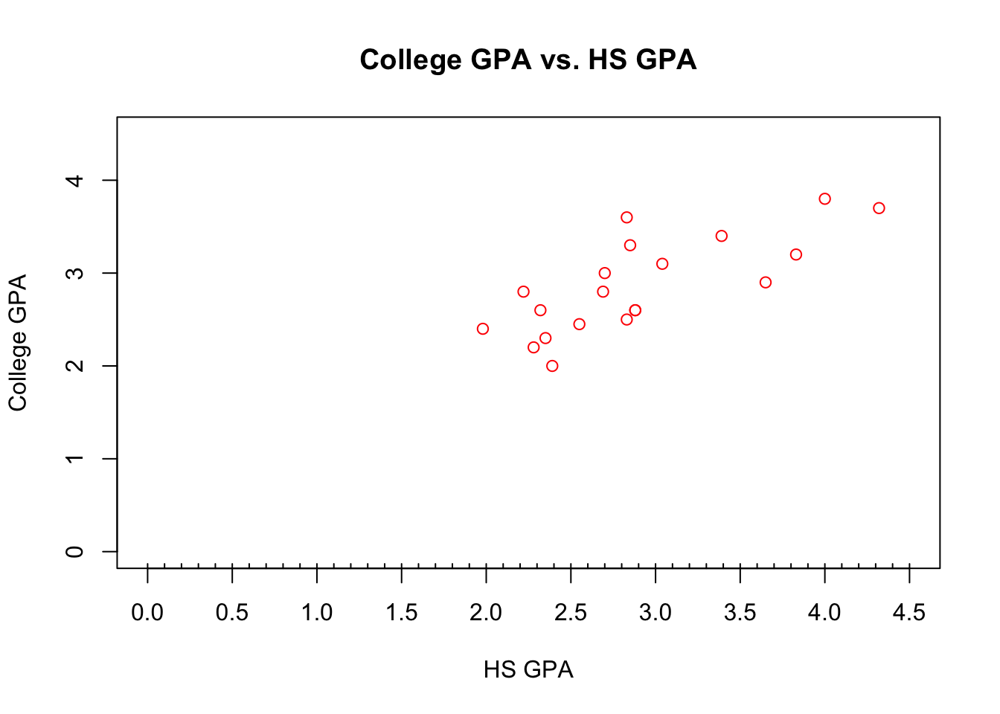
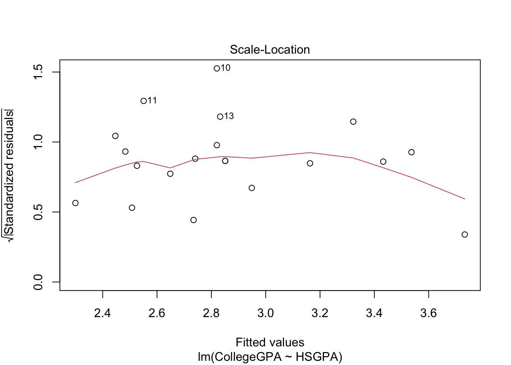
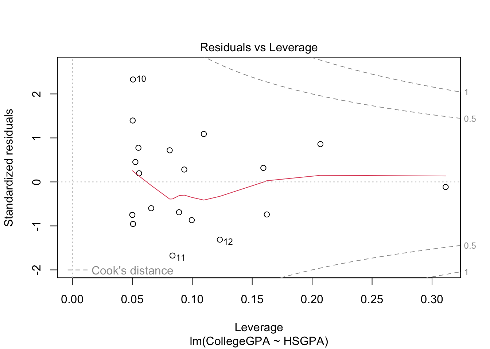

# Introduction to R

We will go over some of the basic R operations in this chapter.

If you have questions, you should check [Chris Bilder's website](http://www.chrisbilder.com/stat878/sections.html) for full information.

## Basic Operation


```r
2+2
#> [1] 4
```


```r
2^3
#> [1] 8
```


```r
# calculate the cdf of std. normal
pnorm(1.96) # 1.96 is the quantile
#> [1] 0.9750021
```


```r
log(1)
#> [1] 0
```


```r
sin(pi/2)
#> [1] 1
```


```r
3/4
#> [1] 0.75
```


```r
save <- 2+2
save
#> [1] 4
```


```r
objects()
#> [1] "save"
```


```r
ls()
#> [1] "save"
```


```r
# quit operaiton
# q() 
```

## Vectors


```r
x <- c(1,2,3,4,5)
x
#> [1] 1 2 3 4 5
```


```r
sd(x)
#> [1] 1.581139
```


```r
mysd <- function(x){
  cat(" My data \n", x, "\n has std deviation",sqrt(var(x)))
}


mysd(x)
#>  My data 
#>  1 2 3 4 5 
#>  has std deviation 1.581139
```


```r
pnorm(q=1.96, mean=1.96, sd=1)
#> [1] 0.5
```

The full syntax for `pnorm()` is `pnorm(q, mean = 0, sd = 1, lower.tail = TRUE, log.p = FALSE)`


```r
pnorm(q=c(-1.96,1.96))
#> [1] 0.0249979 0.9750021
```


```r
x <- c(3.68, -3.63, 0.80, 3.03, -9.86, -8.66, 
    -2.38, 8.94, 0.52, 1.25) 

y <- c(0.55, 1.65, 0.98, -0.07, -0.01, -0.31, 
    -0.34, -1.38, -1.32, 0.53)

x+y
#>  [1]  4.23 -1.98  1.78  2.96 -9.87 -8.97 -2.72  7.56 -0.80
#> [10]  1.78

x*y
#>  [1]   2.0240  -5.9895   0.7840  -0.2121   0.0986   2.6846
#>  [7]   0.8092 -12.3372  -0.6864   0.6625
```


```r
mean(x)
#> [1] -0.631
x-mean(x)
#>  [1]  4.311 -2.999  1.431  3.661 -9.229 -8.029 -1.749  9.571
#>  [9]  1.151  1.881

x*2
#>  [1]   7.36  -7.26   1.60   6.06 -19.72 -17.32  -4.76  17.88
#>  [9]   1.04   2.50
```
The element(elt)-wise operation makes our life easier.

## Files

Click [gpa.csv](http://www.chrisbilder.com/stat878/sections/1/gpa.csv) to download the GPA csv file.

Click [gpa.txt](http://www.chrisbilder.com/stat878/sections/1/gpa.txt) to download the GPA txt file.


```r
getwd()
#> [1] "/Users/weishangjie/Documents/GitHub/Time-Series-Analysis"
```


```r
gpatxt <- read.table("gpa.txt", header=TRUE, sep="")
gpacsv <- read.csv("gpa.csv")
```


```r
gpacsv$HSGPA
#>  [1] 3.04 2.35 2.70 2.55 2.83 4.32 3.39 2.32 2.69 2.83 2.39
#> [12] 3.65 2.85 3.83 2.22 1.98 2.88 4.00 2.28 2.88
```


```r
gpacsv$CollegeGPA
#>  [1] 3.10 2.30 3.00 2.45 2.50 3.70 3.40 2.60 2.80 3.60 2.00
#> [12] 2.90 3.30 3.20 2.80 2.40 2.60 3.80 2.20 2.60
```


```r
gpacsv[1,1] # [row, col]
#> [1] 3.04
```


```r
gpacsv[,1]
#>  [1] 3.04 2.35 2.70 2.55 2.83 4.32 3.39 2.32 2.69 2.83 2.39
#> [12] 3.65 2.85 3.83 2.22 1.98 2.88 4.00 2.28 2.88
```


```r
gpacsv[c(1,3,5),2]
#> [1] 3.1 3.0 2.5
```


```r
gpacsv[,"HSGPA"]
#>  [1] 3.04 2.35 2.70 2.55 2.83 4.32 3.39 2.32 2.69 2.83 2.39
#> [12] 3.65 2.85 3.83 2.22 1.98 2.88 4.00 2.28 2.88
```


```r
summary(gpacsv)
#>      HSGPA         CollegeGPA   
#>  Min.   :1.980   Min.   :2.000  
#>  1st Qu.:2.380   1st Qu.:2.487  
#>  Median :2.830   Median :2.800  
#>  Mean   :2.899   Mean   :2.862  
#>  3rd Qu.:3.127   3rd Qu.:3.225  
#>  Max.   :4.320   Max.   :3.800
```

```r
plot(x = gpacsv$HSGPA, y = gpacsv$CollegeGPA,
     xlab = "HS GPA", ylab = "College GPA", 
     main = "College GPA vs. HS GPA", 
     xlim = c(0,4.5), ylim = c(0,4.5), col = "red", 
    pch = 1, cex = 1.0, panel.first = grid(col = "gray", lty 
    = "dotted"))
```


The `plot()` function creates a two dimensional plot of data. 

Here are descriptions of its arguments:

- x specifies what is plotted for the x-axis.  

- y specifies what is plotted for the y-axis.  

- xlab and ylab specify the x-axis and y-axis labels, respectively.

- main  specifies the main title of the plot.

- xlim and ylim specify the x-axis and y-axis limits, respectively.
  - Notice the use of the c() function. 
  
- col specifies the color of the plotting points. 
  - Run the `colors()` function to see what possible colors can be     used. 
  - Also, you can see [Here](https://github.com/EarlGlynn/colorchart/wiki/Color-Chart-in-R) for the colors from colors(). 
  
- `pch` specifies the plotting characters.

- `cex`specifies the height of the plotting characters. 
   The value 1.0 is the default.
   
- `panel.first = grid()` specifies grid lines will be plotted.

- The line types can be specified as follows: 
`1=solid, 2=dashed, 3=dotted, 4=dotdash, 5=longdash, 6=twodash` or as one of the character strings `"blank", "solid", "dashed", "dotted",  "dotdash", "longdash"`, or `"twodash"`.  
  These line type specifications can be used in other functions.    
- The `par()`(parameter) function’s Help contains more information about the different plotting options!

## Regression

Our model is:$$CollegeGPA=\beta_0+\beta_1HSGPA+\epsilon$$


```r
mod.fit <- lm(formula= CollegeGPA~ HSGPA, data=gpacsv)
mod.fit
#> 
#> Call:
#> lm(formula = CollegeGPA ~ HSGPA, data = gpacsv)
#> 
#> Coefficients:
#> (Intercept)        HSGPA  
#>      1.0869       0.6125
```


```r
names(mod.fit)
#>  [1] "coefficients"  "residuals"     "effects"      
#>  [4] "rank"          "fitted.values" "assign"       
#>  [7] "qr"            "df.residual"   "xlevels"      
#> [10] "call"          "terms"         "model"
```


```r
mod.fit$coefficients
#> (Intercept)       HSGPA 
#>   1.0868795   0.6124941
```


```r
round(mod.fit$residuals[1:5],2)
#>     1     2     3     4     5 
#>  0.15 -0.23  0.26 -0.20 -0.32
```
   

```r
library(tidyverse)
#> ── Attaching packages ─────────────────── tidyverse 1.3.2 ──
#> ✔ ggplot2 3.4.1     ✔ purrr   1.0.1
#> ✔ tibble  3.1.8     ✔ dplyr   1.1.0
#> ✔ tidyr   1.3.0     ✔ stringr 1.5.0
#> ✔ readr   2.1.4     ✔ forcats 0.5.2
#> ── Conflicts ────────────────────── tidyverse_conflicts() ──
#> ✖ dplyr::filter() masks stats::filter()
#> ✖ dplyr::lag()    masks stats::lag()
save.fit <- data.frame(gpacsv, C.GPA.hat = 
    round(mod.fit$fitted.values,2), residuals = 
    round(mod.fit$residuals,2))

save.fit %>% head()
#>   HSGPA CollegeGPA C.GPA.hat residuals
#> 1  3.04       3.10      2.95      0.15
#> 2  2.35       2.30      2.53     -0.23
#> 3  2.70       3.00      2.74      0.26
#> 4  2.55       2.45      2.65     -0.20
#> 5  2.83       2.50      2.82     -0.32
#> 6  4.32       3.70      3.73     -0.03
```


```r
summary(mod.fit)
#> 
#> Call:
#> lm(formula = CollegeGPA ~ HSGPA, data = gpacsv)
#> 
#> Residuals:
#>      Min       1Q   Median       3Q      Max 
#> -0.55074 -0.25086  0.01633  0.24242  0.77976 
#> 
#> Coefficients:
#>             Estimate Std. Error t value Pr(>|t|)    
#> (Intercept)   1.0869     0.3666   2.965 0.008299 ** 
#> HSGPA         0.6125     0.1237   4.953 0.000103 ***
#> ---
#> Signif. codes:  
#> 0 '***' 0.001 '**' 0.01 '*' 0.05 '.' 0.1 ' ' 1
#> 
#> Residual standard error: 0.3437 on 18 degrees of freedom
#> Multiple R-squared:  0.5768,	Adjusted R-squared:  0.5533 
#> F-statistic: 24.54 on 1 and 18 DF,  p-value: 0.0001027
```

Hence, our estimated regression model is$$ \hat{collge.GPA}=\hat{\beta_0}+\hat{\beta_1}HS.GPA
=1.0869+0.6125HS.GPA$$


```r
# Open a new graphics window 
# device new
dev.new(width = 8, height = 6, pointsize = 10)


# 1 row and 2 columns of plots
par(mfrow = c(1,2))
# par= graphic parameter
# mfrow= make a frame by row

# Same scatter plot as before
plot(x = gpacsv$HSGPA, y = gpacsv$CollegeGPA, xlab = "HS 
    GPA", ylab = "College GPA", main = "College GPA vs. 
    HS GPA", xlim = c(0,4.5), ylim = c(0,4.5), col = 
    "red", pch = 1, cex = 1.0, panel.first = grid(col = 
    "gray", lty = "dotted"))
    
# Puts the line y = a + bx on the plot
abline(a = mod.fit$coefficients[1], b = 
    mod.fit$coefficients[2], lty = "solid", col = 
    "blue", lwd = 2)
    

# Same scatter plot as before
plot(x = gpacsv$HSGPA, y = gpacsv$CollegeGPA, xlab = "HS 
    GPA", ylab = "College GPA", main = "College GPA vs. 
    HS GPA", xlim = c(0,4.5), ylim = c(0,4.5), col = 
    "red", pch = 1, cex = 1.0, panel.first = grid(col = 
    "gray", lty = "dotted"))


# Add line
# expr= math expression
curve(expr = mod.fit$coefficients[1] + 
    mod.fit$coefficients[2]*x, 
    xlim = c(min(gpacsv$HSGPA),max(gpacsv$HSGPA)), 
    col= "blue", add = TRUE, lwd = 2)

```

- The `dev.new()` function can be used to open a new plotting window. 
- The `abline()` function can be used to draw straight lines on a plot. In the format used here, the line y = a + bx was drawn where a was the (intercept) and b was the (slope).  

- In the second plot, the curve() function was used to draw the line on the plot. This was done to have the line within the range of the high school GPA values.  

Let's use function to automate what we have done.


```r
my.reg.func <- function(x, y, data) {

    # Fit the simple linear regression model and save the results in mod.fit
    mod.fit <- lm(formula = y ~ x, data = data)

    #Open a new graphics window - do not need to
    dev.new(width = 6, height = 6, pointsize = 10)

    # Same scatter plot as before
    plot(x = x, y = y, xlab = "x", ylab = "y", main = "y vs. x", panel.first=grid(col = "gray", lty = 
      "dotted"))

    # Plot model
    curve(expr = mod.fit$coefficients[1] + 
      mod.fit$coefficients[2]*x, xlim = c(min(x),max(x)), 
      col = "blue", add = TRUE)

    # This is the object returned
    mod.fit
  }
```


```r
save.it <- my.reg.func(x = gpacsv$HSGPA, y = 
    gpacsv$CollegeGPA, data = gpacsv)
```
To get specific x-axis or y-axis tick marks on a plot, use the `axis()` function. For example, 

```r
#Note that xaxt = "n" tells R to not give any labels on the 
#  x-axis (yaxt = "n" works for y-axis)
plot(x = gpacsv$HSGPA, y = gpacsv$CollegeGPA, xlab = "HS GPA", 
     ylab = "College GPA", main = "College GPA vs. HS GPA", 
     xaxt = "n", xlim = c(0, 4.5), ylim = c(0, 4.5), col = 
     "red", pch = 1)
```


```r
plot(x = gpacsv$HSGPA, y = gpacsv$CollegeGPA, xlab = "HS GPA", 
     ylab = "College GPA", main = "College GPA vs. HS GPA", 
     xaxt = "n", xlim = c(0, 4.5), ylim = c(0, 4.5), col = 
     "red", pch = 1)
     
#Major tick marks
axis(side = 1, at = seq(from = 0, to = 4.5, by = 0.5)) 
```




```r
plot(x = gpacsv$HSGPA, y = gpacsv$CollegeGPA, xlab = "HS GPA", 
     ylab = "College GPA", main = "College GPA vs. HS GPA", 
     xaxt = "n", xlim = c(0, 4.5), ylim = c(0, 4.5), col = 
     "red", pch = 1)
     
#Major tick marks
axis(side = 1, at = seq(from = 0, to = 4.5, by = 0.5)) 

#Minor tick marks
axis(side = 1, at = seq(from = 0, to = 4.5, by = 0.1), tck 
      = 0.01, labels = FALSE) 
```



## Object-Oriented Language

Functions are typically designed to operate on only one or very few classes of objects. However, some functions, like `summary()`, are **generic**, in the sense that essentially different versions of them have been constructed to work with different classes of objects. 

When a generic function is run with an object, R first checks the object's class type and then looks to find a method function with the name format `<generic function>.<class name>`. Below are examples for `summary()`: 

- summary(mod.fit) – The function `summary.lm()` summarizes the regression model
- summary(gpacsv) – The function `summary.data.frame()` summarizes the data frame’s contents
- summary.default() – R attempts to run this function if there is no method function for a class

There are many generic functions! For example, `plot()` is a generic function (try` plot(mod.fit)` to see what happens!). We will also see other generic functions like `predict()` later in the notes.


```r
plot(mod.fit)
```



The purpose of generic functions is to use a familiar language set with any object. So it is convenient to use the same language set no matter the application. This is why R is referred to as an object-oriented language.

To see a list of all method functions associated with a class, use `methods(class = <class name>)`. For the regression example, the method functions associated with the `lm` class are:


```r
methods(class="lm") %>% head()
#> [1] "add1.lm"                   "alias.lm"                 
#> [3] "anova.lm"                  "case.names.lm"            
#> [5] "coerce,oldClass,S3-method" "confint.lm"
```

To see a list of all method functions for a generic function, use `methods(generic.function = <generic function name>)`


```r
methods(generic.function = "summary") %>% head()
#> [1] "summary,ANY-method"           
#> [2] "summary,DBIObject-method"     
#> [3] "summary.aov"                  
#> [4] "summary.aovlist"              
#> [5] "summary.aspell"               
#> [6] "summary.check_packages_in_dir"
```

Knowing what a name of a particular method function can be helpful to find help on it. For example, the help for `summary()` alone is not very helpful! However, the help for `summary.lm() `provides a lot of useful information about what is summarized for a regression model.
