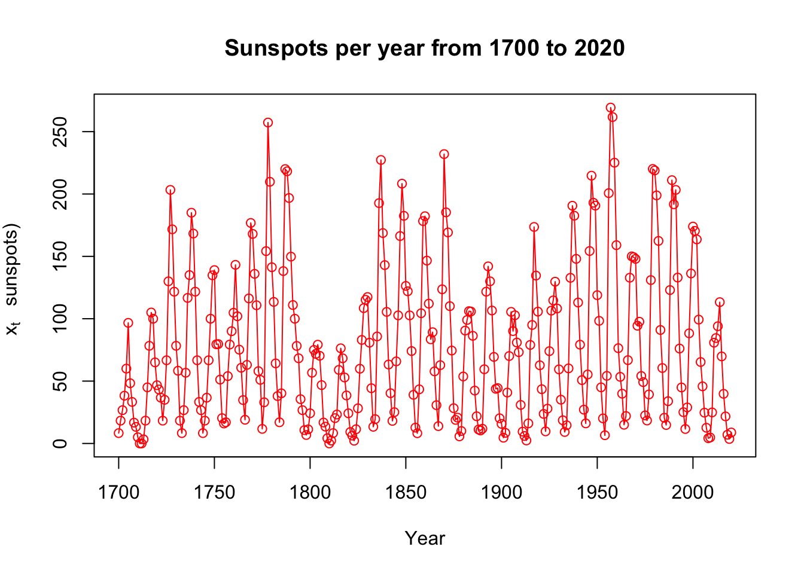

# Plotting 

In this chapter, we will go over some _Time Series_ examples.
The aim of this chapter is to help you grasp some of the ideas about plotting.

## Example Data

Click [OSU_enroll.csv](http://www.chrisbilder.com/stat878/sections/2/OSU_enroll.csv) to download data.


```r
osu.enroll <- read.csv(file = "OSU_enroll.csv", 
    stringsAsFactors = TRUE)
```


```r
head(osu.enroll)
#>   t Semester Year Enrollment      date
#> 1 1     Fall 1989      20110 8/31/1989
#> 2 2   Spring 1990      19128  2/1/1990
#> 3 3   Summer 1990       7553  6/1/1990
#> 4 4     Fall 1990      19591 8/31/1990
#> 5 5   Spring 1991      18361  2/1/1991
#> 6 6   Summer 1991       6702  6/1/1991
```


```r
tail(osu.enroll)
#>     t Semester Year Enrollment      date
#> 35 35   Spring 2001      20004  2/1/2001
#> 36 36   Summer 2001       7558  6/1/2001
#> 37 37     Fall 2001      21872 8/31/2001
#> 38 38   Spring 2002      20922  2/1/2002
#> 39 39   Summer 2002       7868  6/1/2002
#> 40 40     Fall 2002      22992 8/31/2002
```


```r
x <- osu.enroll$Enrollment
```


```r
#One way to do plot
dev.new(width = 8, height = 6, pointsize = 10) 

# we did not specify y-axis and R put our x in y-axis, time in  x-axis

plot(x = x, ylab = "OSU Enrollment", 
       xlab = "t (time)", type="l", col = "red", 
       main = "OSU Enrollment from Fall 1989 to Fall 2002", 
       panel.first = grid(col = "gray", lty = "dotted"))

```


```r
dev.new(width = 8, height = 6, pointsize = 10) 

# we did not specify y-axis and R put our x in y-axis, time in  x-axis

plot(x = x, ylab = "OSU Enrollment", 
       xlab = "t (time)", type="l", col = "red", 
       main = "OSU Enrollment from Fall 1989 to Fall 2002", 
       panel.first = grid(col = "gray", lty = "dotted"))

points(x = osu.enroll$Enrollment, pch = 20, col = "blue")
```

Altenatively, you can do the same thing using ggplot.


```r
library(ggplot2)

# Create a data frame
df <- data.frame(osu.enroll)

# Create the plot
ggplot(df, aes(x = t, y = Enrollment)) +
  geom_line(colour = "red") +  # Line plot
  geom_point(shape = 20, colour = "blue") +  # Add points
  labs(x = "t (time)", y = "OSU Enrollment", 
       title = "OSU Enrollment from Fall 1989 to Fall 2002") +  # Set axis labels and title
  theme_bw() +  # Set the theme to a white background with black lines
  theme(panel.grid.major = element_line(colour = "gray", linetype = "dotted"))  # Add gray dotted lines to the plot
```


When only x is specified in the `plot()` function, R puts this on the y-axis and uses the observation number on the x-axis.

Compare this to the next plot below where both x and y arguments are specified.  


```r
#More complicated plot
fall <- osu.enroll[osu.enroll$Semester == "Fall",]
spring <- osu.enroll[osu.enroll$Semester == "Spring",]
summer <- osu.enroll[osu.enroll$Semester == "Summer",]

plot(y = fall$Enrollment, x = fall$t,
    ylab = "OSU Enrollment", xlab = "t (time)", 
    col = "blue", 
    main = "OSU Enrollment from Fall 1989 to Fall 2002", 
    panel.first = grid(col = "gray", lty = "dotted"), 
    pch = 1, type = "o", ylim = c(0,max(osu.enroll$Enrollment)))

lines(y = spring$Enrollment, x = spring$t, col = "red", 
    type = "o", pch = 2)

lines(y = summer$Enrollment, x = summer$t, col = 
    "darkgreen", type = "o", pch = 3)
    
legend(x="center", legend= c("Fall","Spring","Summer"), pch=c(1,2,3), lty=c(1,1,1), col=c("blue","red","darkgreen"), bty="n")
```


```r
#Another way to do plot with actual dates
plot(y = osu.enroll$Enrollment, 
    x = as.Date(osu.enroll$date, format = "%m/%d/%Y"), 
    xlab = "Time", type = "l", col = "red",  
    main = "OSU Enrollment from Fall 1989 to Fall 2002",
    ylab = "OSU Enrollment")

points(y = osu.enroll$Enrollment, 
    x = as.Date(osu.enroll$date, format = "%m/%d/%Y"), pch 
    = 20, col = "blue")

#Create own gridlines
# v specifies vertical line; h specifies horizontal line
 abline(v = as.Date(c("1990/1/1", "1992/1/1", "1994/1/1", 
    "1996/1/1", "1998/1/1", "2000/1/1", "2002/1/1")),
    lty = "dotted", col = "lightgray")
 abline(h = c(10000, 15000, 20000), lty = "dotted", col = 
    "lightgray")
```


## S&P500 Index

Click [SP500weekly.csv](http://www.chrisbilder.com/stat878/sections/2/SP500weekly.csv) to download data.


```r
SP500 <- read.csv(file="SP500weekly.csv",stringsAsFactors = TRUE)
```


```r
head(SP500)
#>   WeekStart   Open   High    Low  Close AdjClose     Volume
#> 1  1/1/1995 459.21 462.49 457.20 460.68   460.68 1199080000
#> 2  1/8/1995 460.67 466.43 458.65 465.97   465.97 1627330000
#> 3 1/15/1995 465.97 470.43 463.99 464.78   464.78 1667400000
#> 4 1/22/1995 464.78 471.36 461.14 470.39   470.39 1628110000
#> 5 1/29/1995 470.39 479.91 467.49 478.65   478.65 1888560000
#> 6  2/5/1995 478.64 482.60 478.36 481.46   481.46 1579920000
```


```r
tail(SP500)
#>       WeekStart    Open    High     Low   Close AdjClose
#> 1395  9/19/2021 4402.95 4465.40 4305.91 4455.48  4455.48
#> 1396  9/26/2021 4442.12 4457.30 4288.52 4357.04  4357.04
#> 1397  10/3/2021 4348.84 4429.97 4278.94 4391.34  4391.34
#> 1398 10/10/2021 4385.44 4475.82 4329.92 4471.37  4471.37
#> 1399 10/17/2021 4463.72 4559.67 4447.47 4544.90  4544.90
#> 1400 10/24/2021 4553.69 4608.08 4537.36 4605.38  4605.38
#>           Volume
#> 1395 15697030000
#> 1396 15555390000
#> 1397 14795520000
#> 1398 13758090000
#> 1399 13966070000
#> 1400 16206040000
```


```r
x <- SP500$Close
```


```r
#One way to do plot
dev.new(width = 8, height = 6, pointsize = 10) 
#again, we do not specify y-axis here
plot(x = x, ylab = "S&P 500 Index", xlab = "t (time)", 
    type = "l", col = "red", main = "S&P 500 Index from 
    1/1/1995 to 10/25/2021 (weekly)", 
    panel.first = grid(col = "gray", lty = "dotted"))
```


```r
#Another way to do plot with actual dates
plot(y = x, x = as.Date(SP500$WeekStart, format =
    "%m/%d/%Y"), xlab = "Time", type = "l", col = "red", main 
    = "S&P 500 Index from 1/1/1995 to 10/25/2021 (weekly)",
    ylab = "S&P 500 Index")

#Create own gridlines
abline(v = as.Date(c("1995/1/1", "2000/1/1", "2005/1/1", 
    "2010/1/1", "2015/1/1", "2020/1/1")), lty = "dotted", 
    col = "lightgray")

abline(h = seq(from = 0, to = 5000, by = 1000), lty = 
    "dotted", col = "lightgray")
```


```r
# One more way with fine control of the dates
plot(y = x, x = as.Date(SP500$WeekStart, format = 
    "%m/%d/%Y"), xlab = "Time", type = "l", col = "red", 
    main = "S&P 500 Index from 1/1/1995 to 10/25/2021 
    (weekly)", ylab = "S&P 500 Index", xaxt = "n")

axis.Date(side = 1, at = seq(from = as.Date("1995/1/1"),
    to = as.Date("2021/12/31"), by = "years"), labels = 
    format(x = seq(from = as.Date("1995/1/1"), to = 
    as.Date("2021/12/31"), by = "years"), format = "%b%y"), 
    las = 2)  #las changes orientation of labels

#Create own gridlines
abline(v = as.Date(c("1995/1/1", "2000/1/1", "2005/1/1", 
    "2010/1/1", "2015/1/1", "2020/1/1")), lty = "dotted", 
    col = "lightgray")
abline(h = seq(from = 0, to = 5000, by = 1000), lty = 
    "dotted", col = "lightgray")
```


## Sunspots

Click [SN_y_tot_V2.0.csv](http://www.chrisbilder.com/stat878/sections/2/SN_y_tot_V2.0.csv) to download data.


```r
sunspots <- read.table(file = "SN_y_tot_V2.0.csv", sep = 
    ";", col.names = c("Mid.year", "Mean.total", 
   "Mean.SD.total", "Numb.obs.used", "Definitive"))
```


```r
head(sunspots)
#>   Mid.year Mean.total Mean.SD.total Numb.obs.used
#> 1   1700.5        8.3            -1            -1
#> 2   1701.5       18.3            -1            -1
#> 3   1702.5       26.7            -1            -1
#> 4   1703.5       38.3            -1            -1
#> 5   1704.5       60.0            -1            -1
#> 6   1705.5       96.7            -1            -1
#>   Definitive
#> 1          1
#> 2          1
#> 3          1
#> 4          1
#> 5          1
#> 6          1
```


```r
tail(sunspots)
#>     Mid.year Mean.total Mean.SD.total Numb.obs.used
#> 316   2015.5       69.8           6.4          8903
#> 317   2016.5       39.8           3.9          9940
#> 318   2017.5       21.7           2.5         11444
#> 319   2018.5        7.0           1.1         12611
#> 320   2019.5        3.6           0.5         12884
#> 321   2020.5        8.8           4.1         14440
#>     Definitive
#> 316          1
#> 317          1
#> 318          1
#> 319          1
#> 320          1
#> 321          1
```


```r
dev.new(width = 8, height = 6, pointsize = 10)

#again, we did not specify y-axis here
plot(x = sunspots$Mean.total, ylab = "Number of 
    sunspots", xlab = "t (time)", type = "l", col = "red", 
    main = "Sunspots per year from 1700 to 2020",
    panel.first = grid(col = "gray", lty = "dotted"))

points(x = sunspots$Mean.total, pch = 20, col = "blue")

```


```r
# Include dates
plot(y = sunspots$Mean.total, x = sunspots$Mid.year, ylab 
    = "Number of sunspots", xlab = "Year", type = "l", col 
    = "red", main = "Sunspots per year from 1700 to 2020",
    panel.first = grid(col = "gray", lty = "dotted"))

points(y = sunspots$Mean.total, x = sunspots$Mid.year, 
    pch = 20, col = "blue")
```


```r
#Convert to an object of class "ts"

x <- ts(data = sunspots$Mean.total, start = 1700, frequency 
    = 1)

x
#> Time Series:
#> Start = 1700 
#> End = 2020 
#> Frequency = 1 
#>   [1]   8.3  18.3  26.7  38.3  60.0  96.7  48.3  33.3  16.7
#>  [10]  13.3   5.0   0.0   0.0   3.3  18.3  45.0  78.3 105.0
#>  [19] 100.0  65.0  46.7  43.3  36.7  18.3  35.0  66.7 130.0
#>  [28] 203.3 171.7 121.7  78.3  58.3  18.3   8.3  26.7  56.7
#>  [37] 116.7 135.0 185.0 168.3 121.7  66.7  33.3  26.7   8.3
#>  [46]  18.3  36.7  66.7 100.0 134.8 139.0  79.5  79.7  51.2
#>  [55]  20.3  16.0  17.0  54.0  79.3  90.0 104.8 143.2 102.0
#>  [64]  75.2  60.7  34.8  19.0  63.0 116.3 176.8 168.0 136.0
#>  [73] 110.8  58.0  51.0  11.7  33.0 154.2 257.3 209.8 141.3
#>  [82] 113.5  64.2  38.0  17.0  40.2 138.2 220.0 218.2 196.8
#>  [91] 149.8 111.0 100.0  78.2  68.3  35.5  26.7  10.7   6.8
#> [100]  11.3  24.2  56.7  75.0  71.8  79.2  70.3  46.8  16.8
#> [109]  13.5   4.2   0.0   2.3   8.3  20.3  23.2  59.0  76.3
#> [118]  68.3  52.9  38.5  24.2   9.2   6.3   2.2  11.4  28.2
#> [127]  59.9  83.0 108.5 115.2 117.4  80.8  44.3  13.4  19.5
#> [136]  85.8 192.7 227.3 168.7 143.0 105.5  63.3  40.3  18.1
#> [145]  25.1  65.8 102.7 166.3 208.3 182.5 126.3 122.0 102.7
#> [154]  74.1  39.0  12.7   8.2  43.4 104.4 178.3 182.2 146.6
#> [163] 112.1  83.5  89.2  57.8  30.7  13.9  62.8 123.6 232.0
#> [172] 185.3 169.2 110.1  74.5  28.3  18.9  20.7   5.7  10.0
#> [181]  53.7  90.5  99.0 106.1 105.8  86.3  42.4  21.8  11.2
#> [190]  10.4  11.8  59.5 121.7 142.0 130.0 106.6  69.4  43.8
#> [199]  44.4  20.2  15.7   4.6   8.5  40.8  70.1 105.5  90.1
#> [208] 102.8  80.9  73.2  30.9   9.5   6.0   2.4  16.1  79.0
#> [217]  95.0 173.6 134.6 105.7  62.7  43.5  23.7   9.7  27.9
#> [226]  74.0 106.5 114.7 129.7 108.2  59.4  35.1  18.6   9.2
#> [235]  14.6  60.2 132.8 190.6 182.6 148.0 113.0  79.2  50.8
#> [244]  27.1  16.1  55.3 154.3 214.7 193.0 190.7 118.9  98.3
#> [253]  45.0  20.1   6.6  54.2 200.7 269.3 261.7 225.1 159.0
#> [262]  76.4  53.4  39.9  15.0  22.0  66.8 132.9 150.0 149.4
#> [271] 148.0  94.4  97.6  54.1  49.2  22.5  18.4  39.3 131.0
#> [280] 220.1 218.9 198.9 162.4  91.0  60.5  20.6  14.8  33.9
#> [289] 123.0 211.1 191.8 203.3 133.0  76.1  44.9  25.1  11.6
#> [298]  28.9  88.3 136.3 173.9 170.4 163.6  99.3  65.3  45.8
#> [307]  24.7  12.6   4.2   4.8  24.9  80.8  84.5  94.0 113.3
#> [316]  69.8  39.8  21.7   7.0   3.6   8.8
```


```r
class(x)
#> [1] "ts"

class(sunspots$Mean.total)
#> [1] "numeric"
```

### plot.ts()

plot() is a generic function - uses the plot.ts() method function


```r
# we did not specify y-axis here, but x is now ts
plot(x = x, ylab = expression(paste(x[t], " (Number of 
   sunspots)")), xlab = "Year", type = "o", col = "red", main 
   = "Sunspots per year from 1700 to 2020")
```



